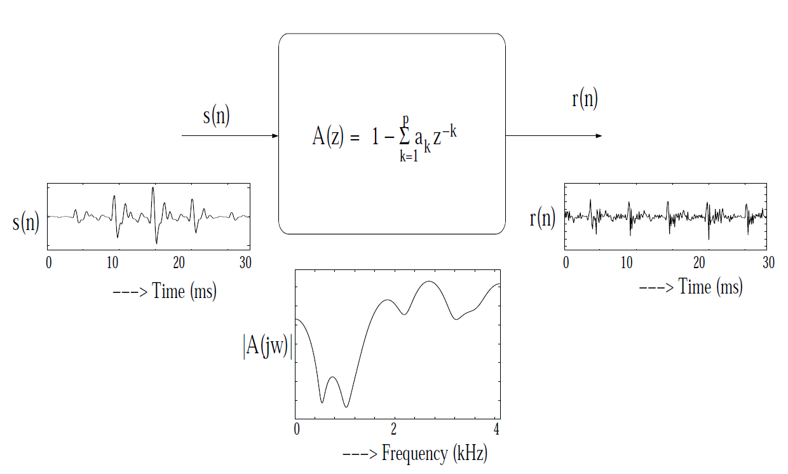
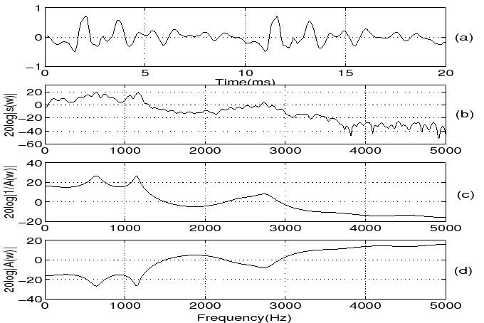
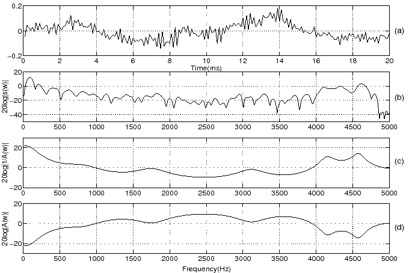
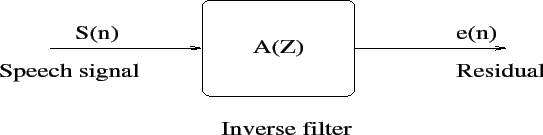
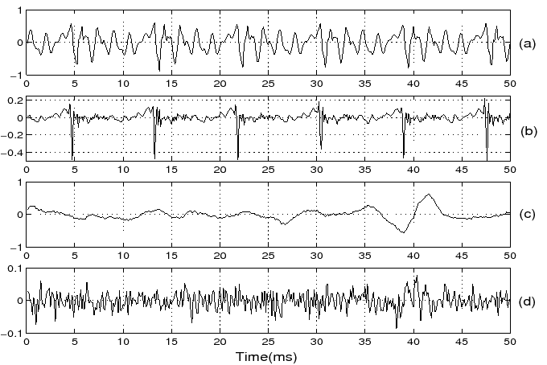
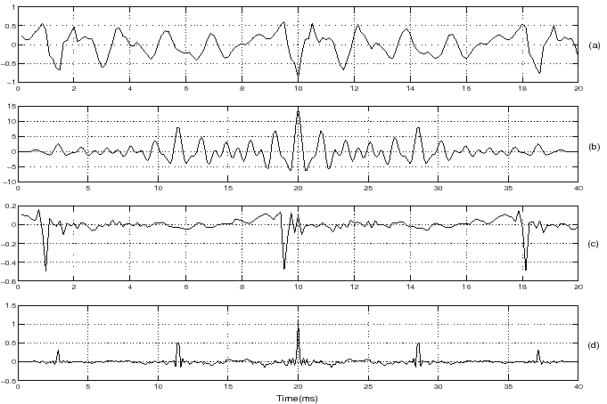
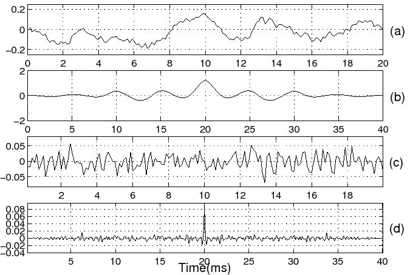
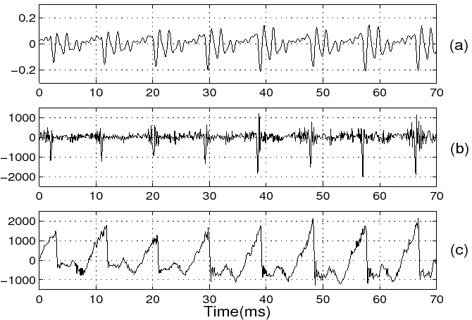
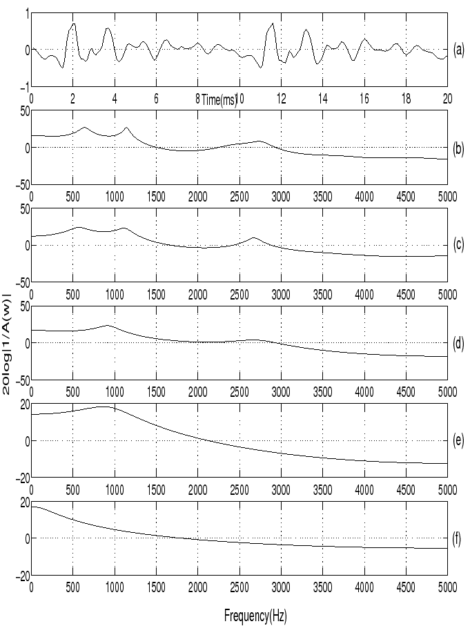
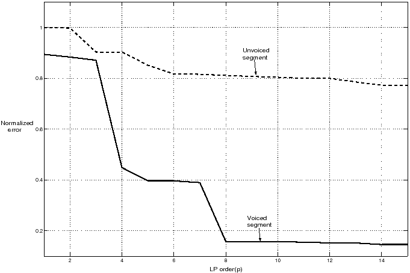

### Source-system modeling of speech signals using LP analysis

The vocal tract system can be modeled as a time-varying all-pole filter using segmental analysis. The segmental analysis corresponds to the processing of speech as short (10-30 ms) overlapped (5-15 ms) windows. The vocal tract system is assumed to be stationary within the window and is modeled as an all-pole filter of order \( p \) using linear prediction (LP) analysis. The LP analysis works on the principle that a sample value in a correlated, stationary sequence can be predicted as a linear weighted sum of the past few (\( p \)) samples. If \( s(n) \) denotes a sequence of speech samples, then the predicted value at the time instant \( n \) is given by $$ \hat{s}(n) = \sum*{k=1}^{p}{a_k ~ s(n-k)} \qquad (1) $$ where \( \{a_k\} , ~ k=1,2,...,p \) is the set of linear predictor coefficients (LPC) and \(p\) is the order of the LP filter. The error at time \(n\) and the sum of squared errors \( E \) are given by $$ r(n) ~ = ~ s(n) ~ - ~ \hat{s}(n) \qquad(2)$$ $$ E= ~ \sum*{n}{r^2(n)} \qquad(3) $$ The cost function \( E \) is minimized with respect to \( \{a*i\}, ~ i=1,2,...,p \) over the interval \( {-\infty} ~ {\leq} ~ n ~ {\leq} ~ {\infty} \) (autocorrelation formulation) as, $$ {\partial{E}}/{\partial{a_i}} ~ = ~ 0 ~ ~ ~ ~ ~ ~ ~ ~ ~ ~ ~ ~ ~ ~ ~ ~ ~ ~ ~ ~ ~ ~ ~ ~ ~ ~ ~ ~ ~ ~ 1 ~ {\leq} ~ i ~ {\leq} ~ p \qquad(4)$$ This minimization leads to a set of normal equations, $$ \sum*{k=1}^{p}{a*k ~ R(i-k)} = -R(i) ~ ~ ~ ~ ~ ~ ~ ~ ~ ~ ~ ~ ~ ~ 1 ~ {\leq} ~ i ~ {\leq} ~ p \qquad(5)$$ where $$ R(i) = \sum*{n=-\infty}^{\infty}s(n) ~ s (n+i) ~ ~ ~ ~ ~ ~ ~ ~ ~ ~ - {\infty} ~ {\leq} ~ i ~ {\leq} ~ {\infty} \qquad(6) $$ is the autocorrelation sequence. The solution of these normal equations gives the values of the predictor coefficients \( \{a_k\}, ~ k = 1,2,...,p \). The error signal \( r(n) \) obtained by inverse filtering the speech signal is referred to as the LP residual. The smooth variations (highly correlated) in the speech signal are captured by the LPCs and are attributed to the vocal tract characteristics. The complex poles of the LP filter occur as conjugate pairs, and each pair represents a resonator cavity, with a maximum response at a frequency (called as resonant frequency) where the poles are located on the z-plane. The vocal tract can be considered as a cascade of resonator cavities with different shapes and sizes. The resonant frequencies of these cavities are referred to as formants. The LP residual signal has large error values at regular intervals and can be attributed to the periodic impulses of excitation. Hence the LP residual is a good approximation to the excitation source signal and can be used further to extract the excitation source characteristics. A segment of voiced speech (windowed), frequency response of the inverse filter and the corresponding LP residual are shown in Figure 1.

The vocal tract system can be modeled as a time-varying all-pole filter using segmental analysis. The segmental analysis corresponds to the processing of speech as short (10-30 ms) overlapped (5-15 ms) windows. The vocal tract system is assumed to be stationary within the window and is modeled as an all-pole filter of order $p$ using linear prediction (LP) analysis. The LP analysis works on the principle that a sample value in a correlated, stationary sequence can be predicted as a linear weighted sum of the past few ($p$) samples. If $s(n)$ denotes a sequence of speech samples, then the predicted value at the time instant $n$ is given by

$$
\hat{s}(n) = \sum_{k=1}^{p} a_k s(n-k) \qquad (1)
$$

where $\{a_k\},\ k=1,2,...,p$ is the set of linear predictor coefficients (LPC) and $p$ is the order of the LP filter. The error at time $n$ and the sum of squared errors $E$ are given by

$$
r(n) = s(n) - \hat{s}(n) \qquad (2)
$$

$$
E = \sum_{n} r^2(n) \qquad (3)
$$

The cost function $E$ is minimized with respect to $\{a_i\},\ i=1,2,...,p$ over the interval $-\infty \leq n \leq \infty$ (autocorrelation formulation) as,

$$
\frac{\partial E}{\partial a_i} = 0 \qquad 1 \leq i \leq p \qquad (4)
$$

This minimization leads to a set of normal equations,

$$
\sum_{k=1}^{p} a_k R(i-k) = -R(i) \qquad 1 \leq i \leq p \qquad (5)
$$

where

$$
R(i) = \sum_{n=-\infty}^{\infty} s(n) s(n+i) \qquad -\infty \leq i \leq \infty \qquad (6)
$$

is the autocorrelation sequence. The solution of these normal equations gives the values of the predictor coefficients $\{a_k\},\ k = 1,2,...,p$. The error signal $r(n)$ obtained by inverse filtering the speech signal is referred to as the LP residual. The smooth variations (highly correlated) in the speech signal are captured by the LPCs and are attributed to the vocal tract characteristics. The complex poles of the LP filter occur as conjugate pairs, and each pair represents a resonator cavity, with a maximum response at a frequency (called as resonant frequency) where the poles are located on the z-plane. The vocal tract can be considered as a cascade of resonator cavities with different shapes and sizes. The resonant frequencies of these cavities are referred to as formants. The LP residual signal has large error values at regular intervals and can be attributed to the periodic impulses of excitation. Hence the LP residual is a good approximation to the excitation source signal and can be used further to extract the excitation source characteristics. A segment of voiced speech (windowed), frequency response of the inverse filter and the corresponding LP residual are shown in Figure 1.

  

 

  Figure 1:
   Inverse filtering the speech signal
   for estimating the excitation source (LP residual) signal.

### Short time spectrum, LP spectrum and Inverse spectrum

The short-time spectrum consists of range of frequencies (magnitude and phase components) that are present in a small segment (10-30 ms) of a signal. An inverse spectrum \(A(j\omega)\) is an all-zero model derived from \(A(z)\). The LP spectrum is an all-pole model given by \(\frac{1}{A(j\omega)}\). The LP spectrum can approximate the envelope of the short-time spectrum depending on the choice of LP order. The gross envelope is captured at low LP orders such as 1 or 3. The short-time spectral envelope is finely matched as the LP order increases. One of the main issues in LP analysis is the choice of appropriate LP order. Figures 2 and 3 show the short-time spectrum, LP spectrum and the inverse LP spectrum for a segment of voiced (/a/) and unvoiced speech (/s/) respectively.

  
 

 Figure 2: 
  (a) Segment of voiced speech /a/ and its 
  (b) short time spectrum, 
  (c) LP spectrum and 
  (d) inverse spectrum (LP order: 10).

 
 

  
 

Figure 3:
 (a) Segment of unvoiced speech /s/ and its 
 (b) short time spectrum, 
 (c) LP spectrum and 
 (d) inverse spectrum (LP order: 10).

 
 

### LP residual for voiced and unvoiced segments

LP residual signal is obtained by passing the speech signal through inverse filter designed with LP coefficients (LPCs). The block diagram of the inverse filter is shown in Figure 4.

  
 

Figure 4: Inverse filter to obtain LP residual signal from speech signal.

 
 
Voiced and unvoiced speech segments and their LP residual signals are shown in Figure 5.

  
 

Figure 5:
 (a) Segment of voiced speech /a/ and its 
 (b) LP residual signal, 
 (c) segment of unvoiced speech /s/ and its 
 (d) LP residual signal (LP order: 10).

 
 

### Autocorrelation function for voiced/unvoiced speech segments and their LP residuals

- Autocorrelation function of the signal \(x[n]\) is computed as
  $$ R[\tau]=\sum\limits\_{n=-\infty}^{+\infty}x[n]x[n+\tau] \qquad(7) $$
- The autocorrelation function for the voiced speech segment and its LP residual signal is shown in Figure 6.

  
 

 

Figure 6:
 (a) Segment of voiced speech /a/ and its 
 (b) autocorrelation function, 
 (c) LP residual for the voiced speech segment and its 
 (d) autocorrelation function (LP order: 10).

 
 
The autocorrelation function for the unvoiced speech segment and its LP residual signal is shown in Figure 7.

  

 

  Figure 7:
   (a) Segment of unvoiced speech /s/
   (b) Autocorrelation function
   (c) LP residual for the unvoiced speech segment
   (d) Autocorrelation function (LP order: 10)

### Glottal pulse shape in voiced portion of a speech signal

- By integrating the LP residual we can obtain the glottal pulse shape, it is also known as glottal volume velocity.
- A segment of voiced speech its LP residual and glottal pulse (glottal volume velocity) waveforms are shown in Figure 8.

  

 

  Figure 8:
   (a) Segment of voiced speech /a/
   (b) LP residual
   (c) Glottal pulse waveform (LP order: 10)

### LP spectrum for different LP orders

- Compute LPCs for different LP orders (14, 10, 6, 3 and 1), and compute LP spectrum for each set of LPCs.
- A segment of voiced speech and its LP spectrum for different LP orders (14, 10, 6, 3 and 1) are shown in Figure 9.

  

 

  Figure 9:
   (a) Segment of voiced speech /a/
   (b) LP spectrum for LP order 14
   (c) LP spectrum for LP order 10
   (d) LP spectrum for LP order 6
   (e) LP spectrum for LP order 3
   (f) LP spectrum for LP order 1

### Normalized error for different LP orders for voiced/unvoiced speech segments

- Normalized error is obtained by normalizing the LP residual energy with respect to speech signal energy. $$\eta = \frac{E_r}{E_s}, \qquad(8) $$ where \(E*r=\sum*{n=0}^{N-1}e^2[n]\) and \(E*s=\sum*{n=0}^{N-1}s^2[n]\) denote the residual and signal energies, respectively.
- Normalized error plots for voiced and unvoiced segments of speech for different LP orders are shown in Figure 10

  

 

  Figure 10:
   Normalized error for voiced and unvoiced speech segments
   for different LP orders.

